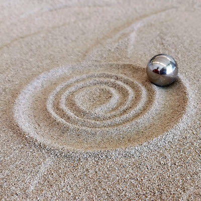

# sandtrails
Tracing sand on a polar plotter.

## Requirements
- Python 3
- adafruit-ws2801 >= 1.0.1 (https://github.com/adafruit/Adafruit_CircuitPython_WS2801)
- flask >= 1.1.1 (https://pypi.org/project/Flask/)

Working principle by https://sisyphus-industries.com/
Blog by Rob Dobson https://robdobson.com/2017/02/a-line-in-the-sand/
Pattern generator: Sandify by Jeff Eberl https://sandify.org/
