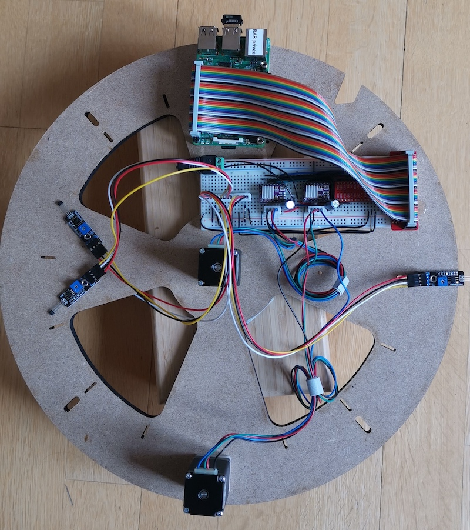

# Gallery

Some impressions of patterns and the build.
All created using [sandify.org](https://sandify.org/)

It looks like after a few dozen iterations, the "sand" at the edges starts to thin out. Any ideas on how to avoid this?

