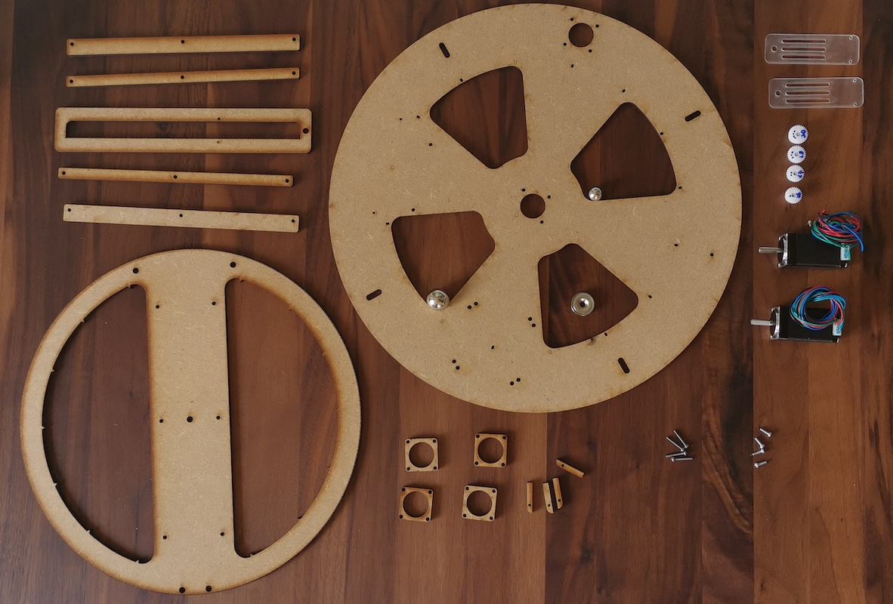

This is to get you started on building your own sand plotter.

## Off-the-shelf parts
The following are the parts I used. Feel free to adapt as you see fit.

| Part name     |  Product |  Supplier   | Cost  |
| ------------- |-------------| -------------|-----:|
| Raspberry pi  | Rasbperry Pi 2    | [Pi-Shop.ch](https://www.pi-shop.ch/raspberry-pi-2-model-b-v1-2-1-gb-ram) | 40 USD |
| Stepper motor | 11HS20-0674S     | [Stepper Online](https://www.omc-stepperonline.com/nema-11-stepper-motor/nema-11-bipolar-1-8deg-12ncm-17oz-in-0-67a-6-2v-28x28x51mm-4-wires.html)      |   15.30 USD |
| Proto-board | Perma-proto hat |  [Adafruit](https://www.adafruit.com/product/2314)  |    7.50 USD |
| Todo | | | |

## Custom parts
Custom parts to be laser-cut from MDF 5mm:

You can get these from the drawing called "Lasercutting" in the [Online Sandtrails CAD model](https://cad.onshape.com/documents/afebf73495f0c93b632a7935/w/49d3e6e5a3398459ea8f339a/e/fbf18bcbe909c6b736bb8e4c)

## Electronics circuit
TODO

## Hardware assembly
View the 3D model to get an idea of how the parts fit together:
[Online Sandtrails CAD model](https://cad.onshape.com/documents/afebf73495f0c93b632a7935/w/49d3e6e5a3398459ea8f339a/e/fbf18bcbe909c6b736bb8e4c)
This is what we shall call things for the purpose of these instructions:

### Linear guide assembly
Align the linear guides around the rho stage. Use 4 to 6 2mm dowel pins to help with alignment. Glue guides in place with enough play to prevent overdue resistance but tight enough so the axis does not "wiggle".

With a similar technique, fix the "lids" on the linera guides.

### Mounting the motors
Many of the screws need to be countersunk manually. (In the future, one might do this by engraving with the lasercutter, but for now that seemed overkill.)
Example for the central "Rho" motor:

Possibly use a 5mm drill for the heads of the M2.5 screws.

Unfortunately, the motor shafts are too long and will collide with the mechanics if mounted directly on the motor mounting plate. Instead of shortening the shafts (difficult to do), use the provided "spacers" to increase the distance from the motor to the motor mounting plate:

Use a spacer of approx. 5mm thickness for the Rho motor. Use a spacer of approx 11mm for the Theta motor. (Using two 5mm spacers was just not enough in my case, used one 5mm MDF spacer plus one 6mm white POM spacer).

### Mounting the electronics
Use standoffs to screw the Rasberry Pi to the hole pattern. Possibly use a 6mm drill to countersink the M3 screws.

Currently stepper motor drivers and GPIOS are accessed via a breakout board. This will be improved with a perma-proto hat for the raspberry pi soon. Glue this in place next to the Raspberry Pi for now. Look out for the limited flexibility of the 40-lead flat cable.

The "Theta" stage uses two of the hall sensors for homing. Countersink the holes and align the hall sensor with the "aiming" holes to make sure they line up with the magnets later.

The "Rho" stage uses a single hall sensor for homing. Countersink the hole and align it radially out from the motor mouting plate as shown.

## Software installation
