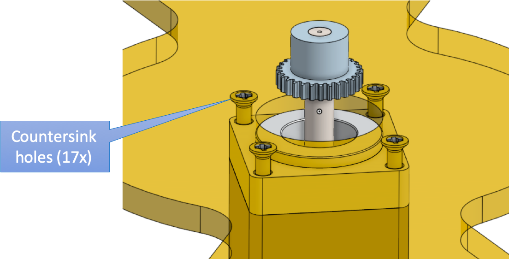

# Sandtrails Documentation Page

[](https://vimeo.com/411987751 "Sandtrails video April 26 2020")

This project and its documentation is very much work-in-progress.

If you have ideas, questions or want to help, head over to the [V1 Engineering Forum](https://forum.v1engineering.com/t/sandtrails-a-polar-sand-table/16844).

These instructions should get you started on building your own sand plotter. For more pictures of what this could look like, see [gallery](gallery).

[](gallery)


## Major todos
- Integrate LED right light
- Drastically improve wiring using a perma-proto hat for the Raspberry Pi.

## Off-the-shelf parts

The following are the parts we used. Feel free to adapt as you see fit.

| Part description     |  Part name |  Supplier   | Approx. cost  |
| ------------- |-------------| -------------|-----:|
| Raspberry pi  | Rasbperry Pi 2 B   | [Pi-Shop.ch](https://www.pi-shop.ch/raspberry-pi-2-model-b-v1-2-1-gb-ram) | 40 USD |
| Motor nema 11 | 11HS20-0674S     | [Stepper Online](https://www.omc-stepperonline.com/nema-11-stepper-motor/nema-11-bipolar-1-8deg-12ncm-17oz-in-0-67a-6-2v-28x28x51mm-4-wires.html)      |   2x 15 USD |
| Proto-board | Perma-proto hat |  [Adafruit](https://www.adafruit.com/product/2314)  |    8 USD |
| Stepper motor driver     |  DRV8825 |  [Pololu](https://www.pololu.com/product/2133)   | 2 x 8 USD  |
| Homing sensor     | Hall sensor |  [RobotDyn](https://robotdyn.com/hall-magnetic-sensor-with-analog-digital-outs.html)   | 3x 1 USD  |
| Service tray     |  service tray |  Aliexpress   | 18 USD  |
| Coffee table     |  Malmsta |  [Ikea](https://www.ikea.com/us/en/p/malmsta-side-table-black-brown-80261183/)   | 150 USD  |
| L bracket     |  80x80x18 mm |  DIY store   | 4x 3 USD  |
| L bracket     |  30x30x15 mm |  DIY store   | 4x 3 USD  |
| Spur gear     |  28 tooth POM |  [Maedler.ch](https://www.maedler.de/Article/28102800)   | 2x 2 USD  |
| Disc magnet Ø5 mm    |  S-05-05-N |  [Supermagnete.ch](https://www.supermagnete.ch/eng/disc-magnets-neodymium/disc-magnet-5mm-5mm_S-05-05-N)   | 1 USD  |
| Pot magnet Ø16 mm    | CSN-16  |  [Supermagnete.ch](https://www.supermagnete.ch/eng/pot-magnets-with-countersunk-borehole/countersunk-pot-magnet-16mm_CSN-16)   | 2 USD  |
| Steel ball Ø13 mm     | ST-K-13-N |  [Supermagnete.ch](https://www.supermagnete.ch/eng/school-magnets/steel-balls-13mm_ST-K-13-N)   | 1 USD  |
| Steel ball Ø20 mm    |  ST-K-20-N |  [Supermagnete.ch](https://www.supermagnete.ch/eng/school-magnets/steel-balls-20mm_ST-K-20-N)   | 1 USD  |
| Capacitors     |  10 uF |  Electronics store   | 2x 0 USD  |
| Screws Raspberry Pi  fixation   |  M2.5 |  Various   | 4x 0USD  |
| Standoffs     |  M3, 10mm |  Various   | 4x 0USD  |
| Screws motor fixation     |  M2.5 x 16mm |  Various   | 4x 0 USD  |
| Screws motor fixation     |  M2.5 x 10mm |  Various   | 4x 0 USD  |
| Power supply Raspberry Pi     |  5 VDC, 2.5 A |  Various   | 20 USD  |
| Power supply stepper motors     |  12 VDC, 1.5 A |  Various   | 20 USD  |


Note that several of the very cheap components have minimum orders. So your "shopping list" will be considerably more expensive than the sum of the above. Shipping also adds up.


## Custom parts

Custom parts are to be laser-cut. Most from MDF 5mm, a few of other thicknesses. See the [PDF](assets/Lasercutting-v2020-04.pdf) for details.


You can also download the latest drawings form the tab called "Lasercutting" in the [Online Sandtrails CAD model](https://cad.onshape.com/documents/afebf73495f0c93b632a7935/w/49d3e6e5a3398459ea8f339a/e/fbf18bcbe909c6b736bb8e4c).


## Wiring

For now, wiring is done via a [GPIO T-cobbler](https://www.adafruit.com/product/2028) on a full size [solderless breadboard](https://www.adafruit.com/product/239).


This can and will be improved in the future. So the following instructions do not go into detail since this will be changing soon anyway.

### Raspberry GPIO pinout


Taken from [https://www.raspberrypi.org/](https://www.raspberrypi.org/documentation/usage/gpio/)

Follow the pinout definition set in [axes.py](../axes.py)
```python
# Axes Configuration: [Theta Axis, Rho Axis]
DIR = [5, 21]            # GPIO pin: Stepper motor set direction
STEP = [6, 20]           # GPIO pin: Stepper motor trigger step
MODE = [(26, 19, 13), (22, 27, 17)]   # GPIO pin: Stepper motor microstep resolution
HOME = [25, 24, 23]       # GPIO pin number for homing switches [THETA 1, THETA 2, RHO]
ENABLE = [16, 12]         # GPIO pin number for enabling stepper motors [THETA, RHO]
```
To clarify: The numbers refer to the GPIO pin number in "BCM" mode ("Broadcom SOC channel").

### Stepper motor driver DRV8825

There is an [excellent tutorial](https://www.rototron.info/raspberry-pi-stepper-motor-tutorial/) on how to set the current limit (important!) on the stepper driver and includes the following pinout of the DRV8825:


Taken from [https://www.rototron.info/](https://www.rototron.info/raspberry-pi-stepper-motor-tutorial/)

### Stepper motor leads

Lead colours of the stepper motors:


Taken from [https://www.omc-stepperonline.com](https://www.omc-stepperonline.com/nema-11-stepper-motor/nema-11-bipolar-1-8deg-12ncm-17oz-in-0-67a-6-2v-28x28x51mm-4-wires.html)

PDF including specs under [assets/datasheets/Stepper-11HS20-0674S.pdf](assets/datasheets/Stepper-11HS20-0674S.pdf)

### Homing sensors (Hall sensors)

The hall sensor pinout is:


Taken from [https://robotdyn.com/](https://robotdyn.com/hall-magnetic-sensor-with-analog-digital-outs.html).

PDF under [assets/datasheets/RobotDyn-HallSensor-Pinout.pdf](assets/datasheets/RobotDyn-HallSensor-Pinout.pdf)


## Hardware assembly

View the 3D model to get an idea of how the parts fit together:
[Online Sandtrails CAD model](https://cad.onshape.com/documents/afebf73495f0c93b632a7935/w/49d3e6e5a3398459ea8f339a/e/fbf18bcbe909c6b736bb8e4c)
This is what we shall call things for the purpose of these instructions:


### Linear guide assembly

Align the linear guides around the rho stage. Use 4 to 6 2mm dowel pins to help with alignment. Glue guides in place with enough play to prevent overdue resistance but tight enough so the axis does not "wiggle".


With a similar technique, fix the "lids" on the liner guides.


Glue two spacers on each side of the rho stage to lift the magnet holder above the pinion of the Rho motor. Again, I used dowel pins (2mm) to align the parts for gluing.


Before gluing the magnet holder on top of this, measure how much distance is between the stack above and the bottom of your sand tray. This will depend on how you fix the sand tray relative to the motor mount plate. You might want to do this at the very end, when everything else is ready.


Bend the magnet holder by heating it (eg. over a candle) to create a "spring" to press the magnet to the sand tray.


Push the homing magnets into the corresponding 5mm holes. 2x on the Theta stage and 1x on the Rho stage. Don't glue them yet, you'll need to check the polarity first before you do so.


### Mounting the motors

Many of the screws need to be countersunk manually. (In the future, one might do this by engraving with the lasercutter, but for now that seemed overkill.)
Example for the central "Rho" motor:

Possibly use a 5mm drill for the heads of the M2.5 screws.


Unfortunately, the motor shafts are too long and will collide with the mechanics if mounted directly on the motor mounting plate. Instead of shortening the shafts (difficult to do), use the provided "spacers" to increase the distance from the motor to the motor mounting plate:

Use a spacer of approx. 5mm thickness for the Rho motor. Use a spacer of approx 11mm for the Theta motor. (Using two 5mm spacers was just not enough in my case, used one 5mm MDF spacer plus one 6mm white POM spacer).


### Mounting the electronics

Use standoffs to screw the Rasberry Pi to the hole pattern. Possibly use a 6mm drill to countersink the M3 screws.


Currently stepper motor drivers and GPIOS are accessed via a breakout board. This will be improved with a perma-proto hat for the raspberry pi soon. Glue this in place next to the Raspberry Pi for now. Look out for the limited flexibility of the 40-lead flat cable.


The "Theta" stage uses two of the hall sensors for homing. Countersink the holes and align the hall sensor with the "aiming" holes to make sure they line up with the magnets later.


The "Rho" stage uses a single hall sensor for homing. Countersink the hole and align it radially out from the motor mouting plate as shown.


## Software installation

This section is still in its infancy. Basic steps are:
- Set up a Raspberry Pi with the latest raspian
- Install the packages from [requirements.txt](../requirements.txt)
- Enable SPI
- Clone the [sandtrails repository](https://github.com/ratnaweera/sandtrails.git)
- Enable SSH  
